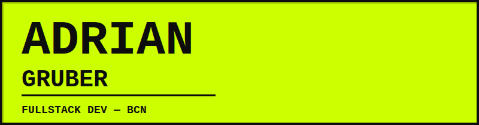

---

**NOW** → Building [Pinio](https://www.pinio-app.com), a social planner & map app. On the App Store. 730+ commits. 5.0 stars.

**BEFORE** → MSc Innovation & Research in Informatics @ UPC Barcelona. Internships at Siemens, Celonis, CERN.

---

```
STACK    TypeScript · Python · React · Next.js · React Native · Node.js · Supabase · Docker
TOOLS    Git · Vercel · Claude Code · n8n · Google Cloud · Sentry · RevenueCat
```

---

<a href="https://trending-footballers.vercel.app"><b>Trending Footballers</b></a> — Real-time dashboard tracking trending footballers worldwide. Next.js + Python + GitHub Actions.

---

<a href="mailto:adr.gruber@gmail.com">adr.gruber@gmail.com</a> · <a href="https://linkedin.com/in/adrian-gruber">LinkedIn</a> · <a href="https://www.pinio-app.com">pinio-app.com</a>
